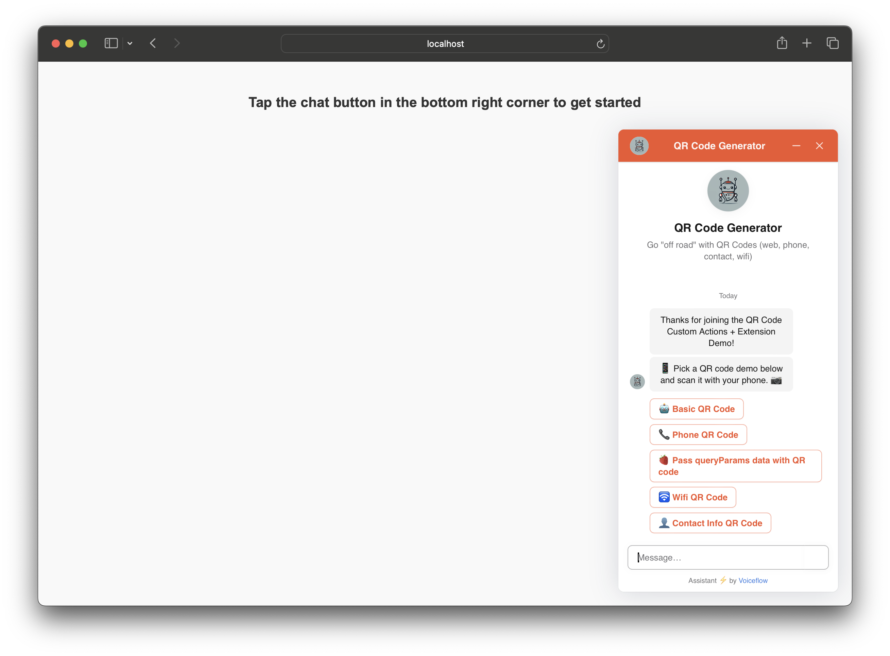
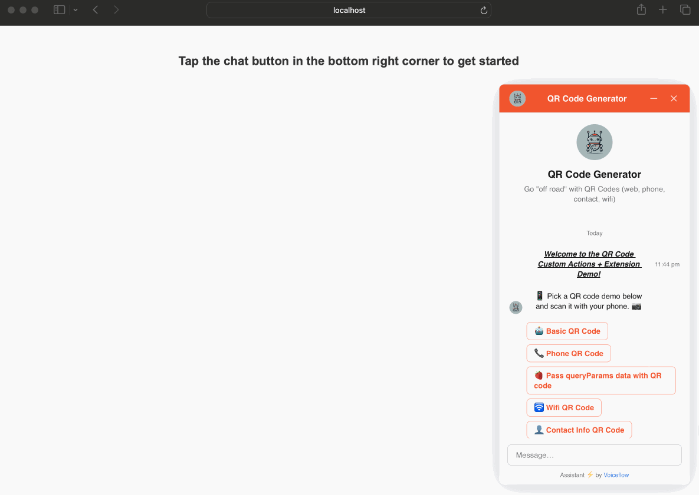
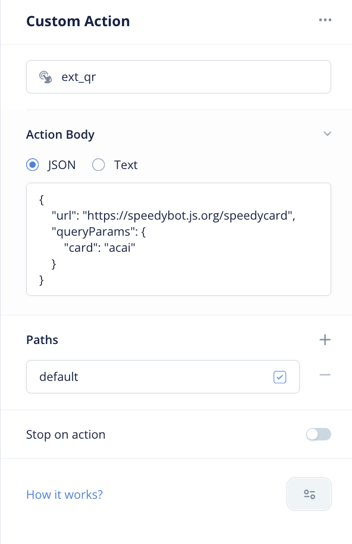

# Voiceflow QR Code Extension



## Key Features

With this extension, you can:

- Launch websites or forms (with optional data passed in the URL)
- Trigger mobile-based authentication
- Deeplink or inter-opt with native mobile applications
- Provide phone numbers for direct calling
- Offer to connect users to a Wi-Fi network
- Share contact information cards

Inspired by Niko's **[Voiceflow Extensions Starter Repo](https://github.com/voiceflow-gallagan/vf-extensions-demo)**. Full documentation available **[here](https://docs.voiceflow.com/docs/custom-web-chat-widgets)**. QR Code generation handled by Denys Kozak's **[qr-code-styling library](https://github.com/kozakdenys/qr-code-styling)**

## Quickstart

### 1. Clone the repository

```bash
git clone https://github.com/valgaze/voiceflow-qrcode
cd voiceflow-qrcode
```

### 2. Create Voiceflow Webchat project

- Sign up or login to **[Voiceflow](https://creator.voiceflow.com/signup)**

- From the dashboard, import the **[project file](https://github.com/valgaze/voiceflow-qrcode/blob/main/voiceflow_project.vf)**.

- The import flow will look roughly like this:


### 3. "Publish" your Voiceflow agent

- Tap the "Publish" button in the top right corner


**Note:** Always publish after making changes to ensure your agent is up-to-date. You can also specify the environment-- **[see here for details](https://docs.voiceflow.com/docs/publishing-environments-backups)**

### 4. Grab your Voiceflow Project Key (not your API key!!)

Open **[config.js](./config.js)** and replace the placeholder with your Voiceflow project ID:

```javascript
const projectID = "__REPLACE__ME__";
```

### 5. Serve the project locally

If you have node installed, run the following command from the project directory:

```
npm run dev

# or run: npx -y http-server -p 1337
```

The project will be served at http://localhost:1337.

Navigate to http://localhost:1337 in your web browser to go through the flow.

<details>
  <summary>Seeing errors?</summary>

You can serve this directory however you prefer, one easy option is NodeJS

Option 1: Download and Install from the [official website](https://nodejs.org/en/download)

Option 2: Install Using Volta

If you prefer to use [Volta](https://docs.volta.sh/guide/) to manage your Node.js installations, follow these steps:

1. Install Volta:

   ```bash
   curl https://get.volta.sh | bash
   ```

2. Install Node.js using Volta:

   ```bash
   volta install node
   ```

Or serve with Python, ex

```sh
python3 -m http.server 1337
```

</details>

### 6. Take it for a spin



### 7. Data payloads from voiceflow

Set the custom action from the Voiceflow canvas to "ext_qr"



#### Website

```json
{
  "url": "https://speedybot.js.org/speedycard",
  "queryParams": {
    "card": "acai"
  }
}
```

#### Phone (optionally specify qrType: 'phone')

```json
{
  "phone": "1-800-555-1212"
}
```

#### WiFi (must specify qrType: 'wifi')

```json
{
  "qrType": "wifi",
  "ssid": "mycoolwifi",
  "password": "this_might_be_a_bad_idea"
}
```

#### Contact (must specify qrType: 'contact')

```json
{
  "qrType": "contact",
  "name": "Sherlock Holmes",
  "org": "221B Baker Street Investigations",
  "phone": "+44 20 7946 0958",
  "email": "sherlock.holmes@bakerstreet.com",
  "description": "You've scanned the QR code for Sherlock Holmes, the world's greatest detective. Known for his unparalleled skills in deduction and a penchant for solving the most baffling mysteries. Whether it's finding missing cats or unraveling intricate plots, Holmes is your go-to. Caution: Engaging in conversation may lead to impromptu crime-solving adventures!"
}
```
